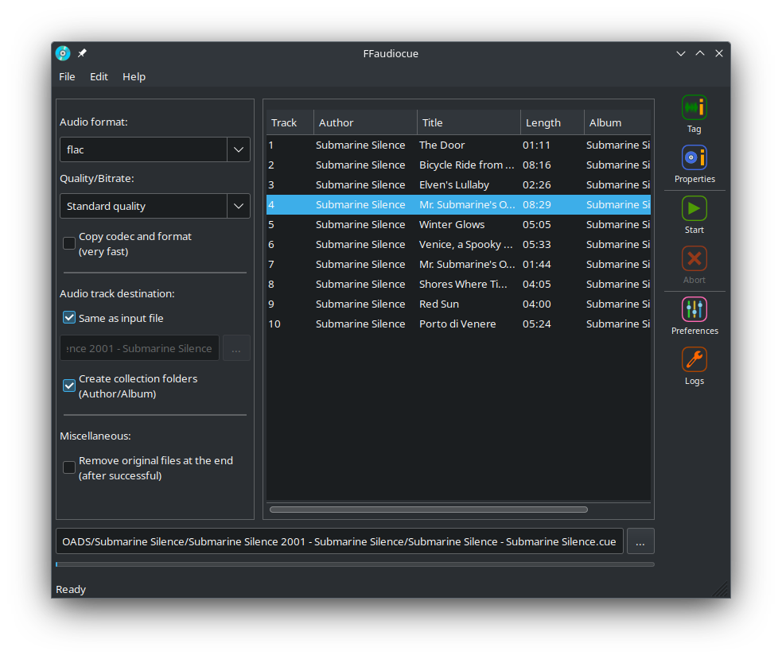

# FFaudiocue

Official GUI to [FFcuesplitter](https://github.com/jeanslack/FFcuesplitter) for audio CDs images extracting.

## Description
FFaudiocue is a cross-platform GUI written in wxPython Phoenix based on 
[FFcuesplitter](https://github.com/jeanslack/FFcuesplitter).
It features editable tags per track, an audio CD properties viewer, support
for WAV, FLAC, MP3, OGG, OPUS output formats, audio compression
selectors and the ability to copy audio codec without re-encoding.

## Requirements
- **[Python >= 3.9](https://www.python.org/)**
- **[wxPython-Phoenix >= 4.0.7](https://wxpython.org/)**
- **[PyPubSub >= 4.0.3](https://pypi.org/project/PyPubSub/)**
- **[ffcuesplitter >= 1.0.31](https://pypi.org/project/ffcuesplitter/)**
- **[requests >=  2.28.1](https://pypi.org/project/requests/)**
- **[ffmpeg >=4.3](https://ffmpeg.org/)**
- **[ffprobe >=4.3](https://ffmpeg.org/ffprobe.html)**

## Installation
Please read the instructions provided with the [INSTALL](https://github.com/jeanslack/FFaudiocue/blob/main/INSTALL) file.

## Authors
See [AUTHORS](AUTHORS) file

## License
The [GNU GENERAL PUBLIC LICENSE Version 3](LICENSE)
